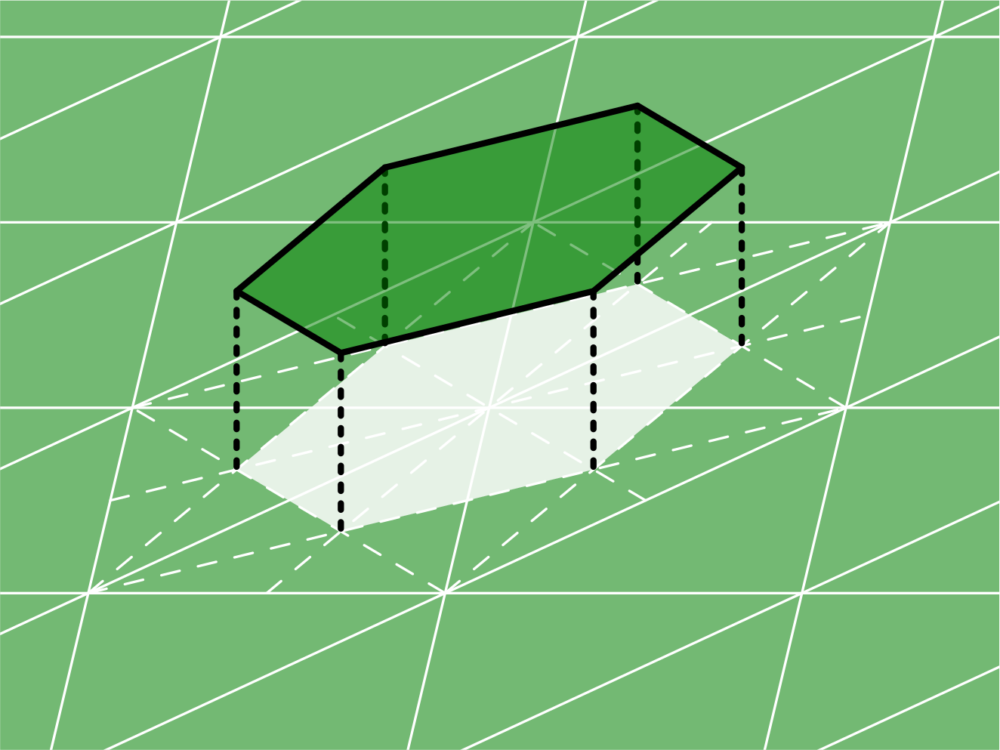
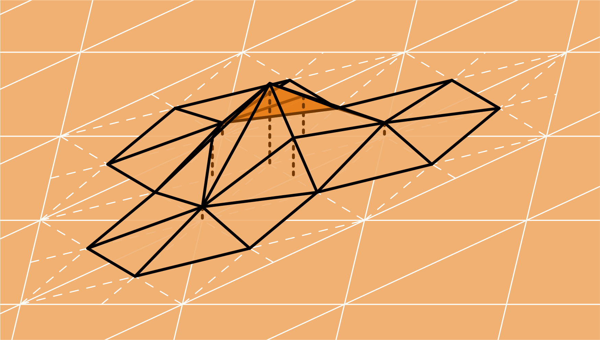

Scalar Function Spaces
======================

The following scalar-valued spaces are supported in Bempp:

---------- | -------- | -----------
Space Type | Order(s) | Description
---------- | -------- | -----------
`"DP"`     | 0 or 1   | Discontinuous polynomials
`"P"`      | 1        | Continuous polynomials
`"DUAL"`   | 0 or 1   | Dual spaces on the barycentrically refined grid
---------- | -------- | -----------

## Discontinuous polynomial spaces
DP spaces are polynomial inside each element and discontinuous between elements.
An example basis function of an order 0 DP space is shown below.

{: .smaller }

These spaces can be created in Bempp with:

```python
space = bempp.api.function_space(grid, "DP", 0)
space = bempp.api.function_space(grid, "DP", 1)
```

The DOFs of an order 0 DP space are at the midpoints of each cell.
The DOFs of an order 1 DP space are at the three vertices of each cell.

## Continuous polynomial spaces
P spaces are polynomial inside each element and continuous between elements.
An example basis function of an order 1 P space is shown below.

{: .smaller }

This space can be created in Bempp with:

```python
space = bempp.api.function_space(grid, "P", 1)
```

The DOFs of an order 1 P space are at the three vertices of each cell.

## Barycentric dual spaces
To define the barycentric dual space, we first create the barycentrically refined mesh by joining
each vertex of every triangle with the centre of the opposite side, as shown below.
{: .smaller }

The order 0 dual spaces are piecewise constant functions on the dual cells.
An example basis function of an order 0 DUAL space is shown below.
Order 0 DUAL spaces form a stable dual pairing with order 1 P spaces.
{: .smaller }

The order 1 dual basis functions are linear combinations of piecewise linear
functions on the barycentric cells, and are defined in
[<em>A dual finite element complex on the barycentric refinement</em> (2007) by A. Buffa and S. Christiansen](https://www.jstor.org/stable/40234460?seq=1).
An example basis function of an order 1 DUAL space is shown below.
Order 1 DUAL spaces form a stable dual pairing with order 0 DP spaces.
{: .smaller }

These spaces can be created in Bempp with:

```python
space = bempp.api.function_space(grid, "DUAL", 0)
space = bempp.api.function_space(grid, "DUAL", 1)
```

The DOFs of an order 0 DUAL space are at the three vertices of each cell
(ie the midpoints of each barycentric dual cell).
The DOFs of an order 1 DUAL space are at the mispoints of each cell
(ie the vertices of each barycentric dual cell).
